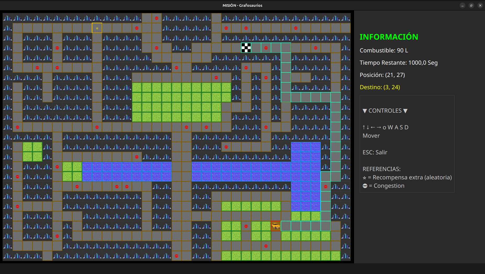

# Shortest Path Algorithms Analysis — "Conduciendo por la ciudad"

Una aplicación en Java que combina una **simulación de ciudad inspirada en GTA** con un **análisis comparativo profundo de algoritmos de camino mínimo**. El proyecto fue construido desde cero: cada estructura de datos es una implementación propia (sin usar Java Collections Framework), la simulación modela vehículos, garajes y concesionarios, y el módulo analítico benchmarkea A\*, Dijkstra y Bellman-Ford sobre grafos de distintos tamaños.



---

## Tabla de contenidos

- [Descripción](#descripción)
- [Desarrollado en equipo](#desarrollado-en-equipo)
- [Funcionalidades principales](#funcionalidades-principales)
- [Tecnologías utilizadas](#tecnologías-utilizadas)
- [Estructura del proyecto](#estructura-del-proyecto)
- [Instalación](#instalación)
- [Configuración](#configuración)
- [Uso](#uso)
- [Video de demostración](#video-de-demostración)
- [Ejemplos y resultados](#ejemplos-y-resultados)
- [Posibles mejoras futuras](#posibles-mejoras-futuras)

---

## Descripción

Este proyecto fue desarrollado originalmente en el contexto de una materia de Estructuras de Datos y Algoritmos, pero fue encarado con foco en diseño de software, modelado orientado a objetos y análisis algorítmico reproducible. El resultado es una aplicación que combina una simulación interactiva de conducción urbana con un módulo de benchmarking pensado para comparar estrategias reales de pathfinding sobre grafos ponderados.

El sistema tiene dos objetivos entrelazados:

1. **Simulación de juego** — Una aplicación de consola + JavaFX que modela un loop de progresión completo: el jugador administra un garaje con capacidad limitada, compra vehículos en un concesionario, mejora infraestructura usando créditos y completa misiones de conducción sobre mapas urbanos cargados desde archivo. Cada misión exige administrar tiempo, combustible, tipo de vehículo y costo operativo, mientras un GPS basado en **A\*** recalcula en todo momento la mejor ruta disponible.

2. **Análisis de algoritmos** — Un módulo automatizado de benchmarking que ejecuta A\*, Dijkstra y Bellman-Ford sobre nueve mapas urbanos de tamaño creciente, recolectando tiempos promedio de ejecución, expansiones de nodos, relajaciones de aristas y operaciones de Priority Queue por consulta. Los resultados se exportan a CSV para su análisis posterior y justifican técnicamente la elección del algoritmo de navegación usado dentro del juego.

Una restricción clave de diseño fue que **todos los tipos abstractos de datos (TDAs) debían implementarse desde cero**: arreglos dinámicos, listas enlazadas, pilas, colas, Hash Tables, sets, Priority Queues, grafos genéricos y más, sin depender de las colecciones de `java.util`.

---

## Funcionalidades principales

### Estructuras de datos propias (TDAs)

Cada estructura fue implementada genéricamente desde cero:

| Estructura | Descripción |
|-----------|-------------|
| `Vector<T>` | Arreglo dinámico con redimensionamiento por factor de dos |
| `Lista<T>` | Lista doblemente enlazada con iterador bidireccional |
| `Pila<T>` | Stack LIFO usando nodos enlazados |
| `Cola<T>` | Queue FIFO usando nodos enlazados |
| `Diccionario<C,V>` | Hash Table con open chaining y rehash según factor de carga |
| `Conjunto<T>` | Hash Set respaldado por `Diccionario` |
| `Matriz<T>` | Arreglo genérico bidimensional de tamaño fijo |
| `ColaPrioridad<T>` | Max-heap (binary heap) sobre `Vector` |
| `Grafo<T>` | Grafo pesado no dirigido usando listas de adyacencia |
| `Tupla<C,V>` | Par genérico clave-valor |
| `Iterador<T>` | Interfaz de iterador bidireccional |

### Algoritmos de camino mínimo

Se implementaron e instrumentaron tres algoritmos para benchmarking:

| Algoritmo | Complejidad  teorica | Característica principal |
|-----------|------------|--------------------------|
| **A\*** | O((V + E) log V) | La heurística Manhattan guía la búsqueda, minimizando los nodos explorados |
| **Dijkstra** | O((V + E) log V) | A\* con heurística nula; explora toda la frontera |
| **Bellman-Ford** | O(V × E) | Basado en relajaciones; el más lento, pero soporta pesos negativos |

Los tres fueron instrumentados para contar expansiones de nodos, relajaciones de aristas y operaciones de Priority Queue por consulta. Cada experimento promedió 1 000 pares origen-destino aleatorios × 10 repeticiones, usando una semilla fija para garantizar reproducibilidad.

### Simulación de ciudad estilo GTA

- **Jerarquía de vehículos** — `Auto`, `Moto` y `Exotico` extienden una clase abstracta `Vehiculo` con lógica polimórfica de costo de mantenimiento y consumo de combustible.
- **Modelo económico del vehículo** — Cada vehículo mantiene precio, cantidad de ruedas, capacidad de combustible, gasolina actual, kilometraje y velocidad máxima. El mantenimiento diario depende del tipo: autos y motos incrementan su costo según kilometraje acumulado, mientras que los exóticos agregan un costo fijo adicional y una fórmula especial por rueda.
- **Garaje (`Garaje`)** — El garaje comienza con espacio para **5 vehículos** y puede ampliarse usando créditos obtenidos en el juego. Si el jugador compra un vehículo y no hay lugar disponible, el sistema lo envía a una **cola de espera FIFO**, preservando el orden de compra hasta que se liberen o adquieran espacios.
- **Costo operativo diario** — El mantenimiento diario del garaje se calcula como la **suma de los costos de mantenimiento de todos los vehículos almacenados** en él. Ese costo se descuenta al avanzar de día, de modo que la progresión del juego obliga a balancear rendimiento, consumo y sustentabilidad económica.
- **Gestión de combustible** — Cada vehículo puede cargarse de forma parcial o hasta completar su capacidad máxima. El garaje además soporta recarga masiva de combustible para toda la flota, lo que simplifica la preparación antes de una misión.
- **Concesionario (`Concesionario`)** — Catálogo de vehículos con búsqueda, compra y persistencia en CSV.
- **Mapas de ciudad** — Grillas rectangulares cargadas desde archivos de texto con cuatro tipos de terreno: calle (`+`), edificio (`#`), parque (`-`) y agua (`~`). Los edificios y el agua son intransitables; las calles y los parques se traducen a nodos transitables con costos distintos dentro del grafo.
- **Tráfico y costo de movimiento** — Las calles tienen costo base 1, pero pueden presentar congestión aleatoria y pasar a costar más tiempo al atravesarlas. Los parques también son transitables, aunque su costo es mucho mayor, por lo que el GPS solo los usa cuando conviene en términos globales de ruta.
- **Navegación GPS** — El pathfinding con A\* encuentra la ruta más barata sobre el estado actual del mapa y la recalcula dinámicamente a medida que el jugador avanza. Esto permite que el camino sugerido refleje posición actual, terreno y penalizaciones activas del mapa.
- **Misiones con riesgo y recompensa** — Cada misión genera un punto de salida y un destino transitables, descuenta tiempo y combustible en cada movimiento, y aumenta el kilometraje del vehículo utilizado. Además, pueden aparecer recompensas aleatorias sobre el mapa: **créditos**, **dinero** o, en casos raros, **vehículos exóticos**, que solo se obtienen de esta manera y no están disponibles en el concesionario.
- **Tres niveles de dificultad** — El juego ofrece misiones **fáciles**, **moderadas** y **difíciles**, con distintos límites de tiempo, recompensas y restricciones. Las difíciles además pueden exigir un tipo de vehículo específico, lo que introduce una capa adicional de planificación sobre la composición del garaje.
- **UI basada en menús** — Una interfaz en capas de consola + JavaFX que cubre nueva/cargar partida, gestión de garaje, exploración del concesionario y despacho de misiones.

### Benchmarking y análisis

- Carga nueve mapas urbanos que van desde ~31 vértices / 60 aristas hasta ~844 vértices / 1748 aristas.
- Ejecuta una suite de experimentos reproducible y exporta los resultados a `resultados/mediciones.csv`.
- Cubre tanto mapas regulares como mapas deformados intencionalmente (grafos dispersos/asimétricos) para hacer stress-test de cada algoritmo.

---

## Tecnologías utilizadas

| Tecnología | Rol |
|------------|-----|
| **Java 11** | Lenguaje principal |
| **JavaFX 20.0.1** | Interfaz gráfica y multimedia para misiones|
| **Maven** | Build, gestión de dependencias y testing |
| **JUnit 5** | Pruebas unitarias para todos los TDAs propios |
| **PlantUML** | Documentación de diagramas de clases UML |

> No se utilizaron librerías externas de algoritmos o estructuras de datos. Todos los TDAs fueron construidos desde primeros principios.

---

## Estructura del proyecto

```
shortest-path-algorithms-analysis/
│
├── data/
│   ├── ciudades/          # Mapas urbanos para el juego (mapa1–mapa8.txt)
│   ├── analisisCiudades/  # Mapas urbanos para benchmarking (mapa1–mapa9.txt + variantes deformadas)
│   ├── default/           # CSVs de inventario inicial de vehículos
│   └── vehiculos/         # Catálogo de vehículos exóticos
│
├── src/
│   ├── main/java/org/ayed/
│   │   ├── Main.java                  # Punto de entrada de la aplicación
│   │   ├── gta/                       # Simulación del juego
│   │   │   ├── Vehiculo.java          # Vehículo abstracto (Auto, Moto, Exotico)
│   │   │   ├── Garaje.java            # Garage con zona de espera FIFO
│   │   │   ├── Concesionario.java     # Catálogo del dealership
│   │   │   ├── mapa/                  # Carga de mapas, generación de grafo, GPS
│   │   │   │   ├── Mapa.java
│   │   │   │   ├── Nodo.java
│   │   │   │   └── Coordenada.java
│   │   │   ├── Menus/                 # Jerarquía de menús de consola
│   │   │   └── ui/                    # Vistas y controladores JavaFX
│   │   ├── tda/                       # Estructuras de datos propias
│   │   │   ├── vector/
│   │   │   ├── lista/
│   │   │   ├── colaPrioridad/
│   │   │   ├── diccionario/
│   │   │   ├── conjunto/
│   │   │   ├── grafo/
│   │   │   ├── matriz/
│   │   │   ├── iterador/
│   │   │   ├── tupla/
│   │   │   ├── comparador/
│   │   │   └── aestrella/             # A* con interfaz de heurística
│   │   └── informe/                   # Módulo de benchmarking
│   │       ├── programa/
│   │       │   └── algoritmos/        # A*, Dijkstra, Bellman-Ford (instrumentados)
│   │       └── resultados/            # Salida CSV
│   └── test/java/org/ayed/tda/        # Pruebas JUnit 5 para TDAs
│
├── doc/                   # Capturas de pantalla y fuentes PlantUML
├── UMLs/                  # Código de diagramas UML
└── pom.xml
```

---

## Instalación

**Prerrequisitos:**
- Java 11 o superior (se recomienda Java 17+)
- Maven 3.6+
- Un JDK compatible con JavaFX, o el SDK de JavaFX instalado por separado

**Clonar el repositorio:**

```bash
git clone https://github.com/<your-username>/shortest-path-algorithms-analysis.git
cd shortest-path-algorithms-analysis
```

**Instalar dependencias:**

```bash
mvn install -DskipTests
```

---

## Configuración

### Inventario inicial de vehículos

El juego carga su inventario inicial de vehículos desde dos archivos CSV:

- `data/default/default_garaje.csv` — vehículos precargados en el garage
- `data/default/default_concesionario.csv` — vehículos disponibles en el dealership

Podés editar estos archivos directamente para personalizar el inventario inicial. Cada fila sigue el formato:

```
NOMBRE,PRECIO,TIPO,RUEDAS,CAPACIDAD_GASOLINA,GASOLINA_ACTUAL,KILOMETRAJE,VELOCIDAD_MAXIMA
Fiat 600,500,AUTO,4,90,0,0,150
```

### Mapas de ciudad

Los mapas son archivos de texto plano en formato de grilla. Cada celda es una de las siguientes:

| Símbolo | Terreno | Costo |
|--------|---------|-------|
| `+` | Calle | 1 (* 5 si hay tráfico) |
| `-` | Parque | 15 |
| `#` | Edificio | Intransitable |
| `~` | Agua | Intransitable |

Se pueden agregar nuevos mapas en `data/ciudades/` y seleccionarlos desde el menú de misiones.

---

## Uso

### Video de demostración

Recorrido completo del juego en menos de 5 minutos: navegación por menús, gestión del garaje, compra en el concesionario y una misión con GPS en tiempo real.

▶️ **[Ver video de demostración](https://drive.google.com/file/d/1-wpHSg8PORbuOqN_nmjHhJw3OPbRReaN/view?usp=sharing)**

---

### Ejecutar el juego

```bash
mvn -DskipTests exec:java \
	-Dexec.mainClass="org.ayed.Main" \
	-Dexec.cleanupDaemonThreads=false \
	-Dexec.vmArgs="--add-modules=javafx.controls,javafx.fxml,javafx.media"
```

La aplicación comienza con un menú principal basado en consola:

```
MenuInicio
├── Nueva Partida       → crear una nueva sesión de juego
├── Cargar Partida      → reanudar desde un estado guardado
├── Créditos
└── Salir
```

Una vez dentro, podés:
- **Administrar tu garage** — operar una flota con 5 espacios iniciales, ampliar capacidad con créditos, revisar vehículos en cola de espera y decidir qué unidades conviene conservar por su costo de mantenimiento diario
- **Explorar el consecionario** — buscar vehículos por nombre o marca, comprar unidades compatibles con el presupuesto y derivarlas al garaje o a la zona de espera si no queda lugar
- **Iniciar una misión** — seleccionar dificultad, elegir un vehículo válido, recorrer el mapa usando WASD y seguir un GPS que recalcula la mejor ruta según terreno, tráfico y posición actual
- **Buscar recompensas estratégicas** — desviarte del camino óptimo para recoger dinero, créditos de garaje o vehículos exóticos, evaluando el riesgo  de perder la mision por costo adicional en tiempo y combustible
- **Guardar y salir** — persistir el estado del jugador, su dinero y la información del garaje en archivos CSV

### Lógica de progresión del juego

El loop principal está organizado por días. En cada jornada el jugador intenta completar una misión, cobra la recompensa si tiene éxito y luego avanza al día siguiente. Ese avance diario descuenta automáticamente el costo de mantenimiento total del garaje; si la economía del jugador deja de ser sostenible, la partida termina.

Las misiones fueron diseñadas para combinar navegación algorítmica y toma de decisiones. Cada movimiento consume un litro de combustible, suma kilometraje al vehículo y agrega tiempo en función del costo del terreno dividido por la velocidad máxima del vehículo.

Las dificultades estructuran esa progresión:

- **Fácil** — límite de tiempo amplio y recompensa inicial orientada a construir una base económica.
- **Moderada** — menor margen de error, mejor recompensa y mayor presión sobre el uso eficiente del combustible y del tiempo.
- **Difícil** — límite estricto, recompensa alta y restricción por tipo de vehículo, lo que obliga a planificar inventario, espacio y upgrades del garaje con anticipación.

### Ejecutar la suite de benchmarking

El módulo de análisis puede ejecutarse como una main class independiente:

```bash
mvn -DskipTests exec:java \
	-Dexec.mainClass="org.ayed.informe.programa.PruebaComplejidad"
```

Esto ejecuta A\*, Dijkstra y Bellman-Ford sobre los nueve mapas de benchmark y escribe los resultados en:

```
src/main/java/org/ayed/informe/resultados/mediciones.csv
```

### Solo compilar

```bash
mvn compile -DskipTests
```

### Ejecutar pruebas

```bash
mvn test
```

### Empaquetar como JAR

```bash
mvn package -DskipTests
```

---

## Ejemplos y Resultados


### Navegación GPS

Cuando comienza una misión, el jugador selecciona un mapa. La clase `Mapa` parsea la grilla en un grafo ponderado, aplica tráfico probabilístico (10 % de las calles, con semilla reproducible), y luego A\* calcula el camino de menor costo. El juego después renderiza el recorrido y simula el viaje paso a paso.

Sobre esa base, el sistema integra una lógica de juego adicional: el vehículo elegido condiciona cuánto tarda cada desplazamiento según su velocidad máxima, cuánto combustible puede sostener y cuánto costará conservarlo en días posteriores.

### Resultados del Benchmark de Algoritmos

Se realizó un análisis experimental comparativo de A\*, Dijkstra y Bellman-Ford sobre nueve mapas urbanos, representados por grafos de tamaño creciente de V+E (desde 97 hasta 2592). Cada benchmark ejecutó 1000 pares de origen-destino aleatorios por mapa, repetidos 10 veces con semilla fija para garantizar reproducibilidad.

Los gráficos de rendimiento, análisis de expansiones de nodos, relajaciones de aristas y operaciones de Priority Queue están disponibles en:

📊 **[Informe de complejidad algorítmica](Informe_de_complejidad_Algoritmica.pdf)** — Documento completo con gráficos comparativos, tablas detalladas y análisis estadístico.

**Datos crudos:**

Los resultados de cada ejecución se exportan a CSV y están disponibles en:

```
src/main/java/org/ayed/informe/resultados/mediciones.csv
```

**Conclusión del análisis:**

- **A\*** presenta el desempeño más eficiente en todas las instancias evaluadas. Su curva de crecimiento es notablemente más plana que la de los otros algoritmos, lo que indica que la cantidad de expansiones y relajaciones se mantiene acotada independientemente del tamaño del mapa.
- **Dijkstra** exhibe una cantidad de operaciones consistentemente superior a A*. Su comportamiento refleja una exploración en "ondas" o círculos concéntricos desde el origen; al carecer de una guía hacia el destino, se ve obligado a relajar una mayor proporción de aristas para garantizar la optimalidad. No obstante, su crecimiento sigue una tendencia log-lineal estable (O(ElogV)), consolidándose como un baseline robusto y confiable.
- **Bellman-Ford** La curva de este algoritmo muestra una pendiente pronunciada que escala rápidamente con el tamaño del grafo. Dado que su mecánica se basa en múltiples pasadas sobre la totalidad de las aristas, el volumen de operaciones resulta órdenes de magnitud superior a los métodos basados en colas de prioridad. Este comportamiento lo posiciona como el candidato menos apto para un sistema dinámico como el GPS de un juego, donde el recálculo constante de rutas volvería ineficiente la experiencia de usuario.

---

## Desarrollado en equipo

Este proyecto fue desarrollado en grupo.

**Integrantes:**

- Devitt, Francisco Augusto
- Gonzales, Axel
- Sciaini, Carola
- Woiciechowski, Matias